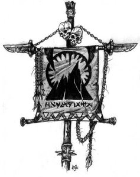

# BLACKROCK CLAN



# [LORE](https://wow.gamepedia.com/Blackrock_clan)

The Blackrock clan is a prominent orcish clan originally hailing from
the caverns of Gorgrond. On Draenor, they were known for their strict
military discipline and skills in mining and blacksmithing. One of the
first orcish clans to be taught the ways of fel magic, the Blackrocks
were the strongest faction within the Old Horde during the course of
the First and Second Wars, and the Horde's first two Warchiefs —
Blackhand and his deposer Orgrim Doomhammer — were both Blackrocks.

# heroes

This is simple proof of concept events index and search system.

It has only kafka as dependency, it abuses the fact that offsets are
ordered within a partition, and builds inverted indexes that can be searched


Composed of the following characters:

* [orgrim ](orgrim/) - consume events

```

% curl -d '{"hello":"world"}' http://orgrim/push/raw?open=true&type=web
{
  "success": true
}

```


* [jubei](jubei/) - create indexes

```

writing offset 91 at /j/blackrock/0/type/web.p
writing offset 91 at /j/blackrock/0/open/true.p
writing offset 91 at /j/blackrock/0/year/2019.p
writing offset 91 at /j/blackrock/0/year-month/2019-06.p
writing offset 91 at /j/blackrock/0/year-month-day/2019-06-30.p
writing offset 91 at /j/blackrock/0/year-month-day-hour/2019-06-30-12.p

```
* [khanzo](khanzo/) - search

```
% curl -d '{
  "partition": 1,
  "query": {
    "or": [
      {
        "tag": {
          "key": "type",
          "value": "web"
        }
      },
      {
        "tag": {
          "key": "open",
          "value": "true"
        }
      }
    ]
  }
}' http://khanzo/search
```

returns lists of all objects matching the query, sorted by score

```

{
  "hits": [
    {
      "offset": 91,
      "partition": 0,
      "score": 2
    },
    {
      "offset": 91,
      "partition": 0,
      "score": 1
    },
  ],
  "size": 2
}

```

* [blackhand](blackhand/) - fetch specific offset


```
% curl localhost:9003/get/0/92

{"hello":"world"}
```


# do not use in production, it is 1 day old