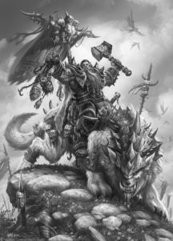

# ORGRIM DOOMHAMMER  warchief : leader



> “I rule the Horde now, Gul'dan. Not you, not your
>  warlocks. Doomhammer alone. And there will be no more dishonor. No
>  more treachery. No more deceit and lies!”


# [LORE](https://wow.gamepedia.com/Orgrim_Doomhammer)

Orgrim Doomhammer was the Warchief of the Old Horde and Chieftain of
the Blackrock clan during the end of the First War and the entirety of
the Second War. The orcish capital of Orgrimmar, the Horde-controlled
town of Hammerfall in the Arathi Highlands, and the flying battleship
Orgrim's Hammer patrolling the skies of Icecrown, are named in his
honor. He was also known as the Backstabber by loyalists of Gul'dan
and Blackhand.


# consume events

Consume events and write them to kafka enveloping with metadata

```
curl -d '{"hello":"world"}' 'http://localhost:9001/push/raw?app_open=true&type=example'

```

all query params are tags in the form of key:value, this creates protobuf message with the following schema:

```

message Metadata {
        map<string,string> tags = 1;
        string remoteAddr  = 2;
        int64 createdAtNs  = 3;
}

message Envelope {
        Metadata metadata = 1;
        bytes payload = 2;
}

```
